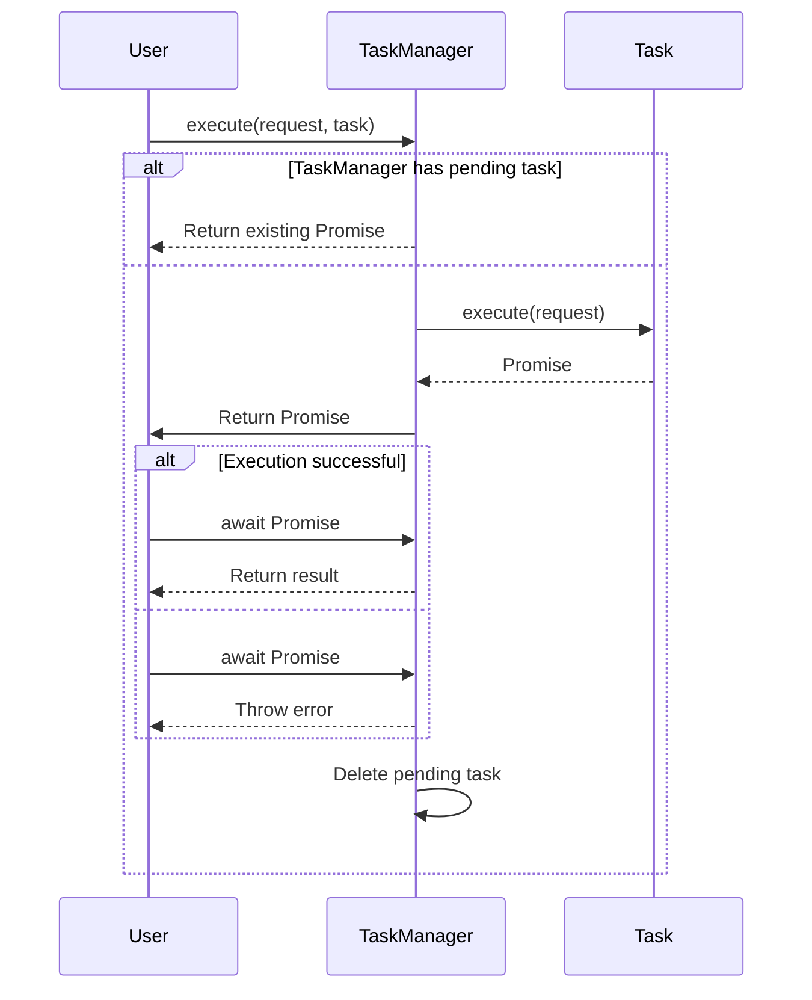

## `TaskManager`

The `TaskManager` class is responsible for request deduplication.

## Properties

- `pendingTasks`: A map that stores the promises for each task, keyed by a serialized representation of the task request.

## Methods

- `execute<TResult>(request: TRequest, task: TTask): Promise<TResult>`:
  - Parameters:
    - `request` (TRequest): The request for the task.
    - `task` (TTask): The task function to be executed.
  - Returns:
    - `Promise<TResult>`: A promise that resolves to the result of the executed task.
  - Behavior:
    - Checks if a task with the same request is already pending.
    - If the task is pending, returns the existing promise for that task.
    - If the task is not pending, executes the task and stores the promise in `pendingTasks`.
    - Deletes the task from `pendingTasks` after execution.

## Helper Methods

- `serialize(request: TRequest): string`:
  - Parameters:
    - `request` (TRequest): The request object to be serialized.
  - Returns:
    - `string`: The serialized representation of the request object.

## Sequence Diagram



## Example Usage

```ts
const taskManager = new TaskManager();

const request = {
  /* your request object */
};
const task = async (request) => {
  /* your task logic */
};

const result = await taskManager.execute(request, task);

console.log('Result:', result);
```
