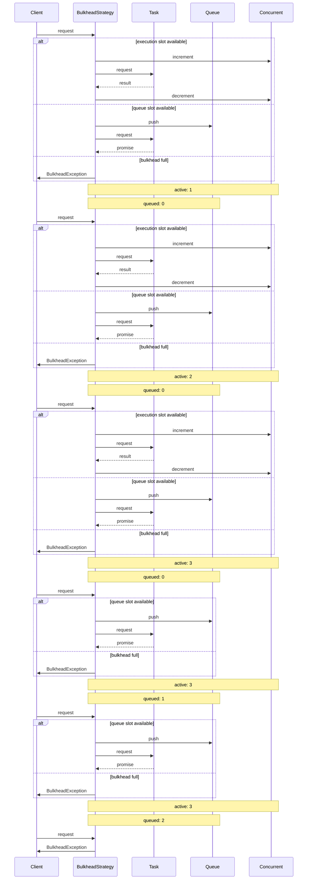

# Sequence Diagram

```mermaid
sequenceDiagram
  participant Client
  participant BulkheadStrategy
  participant Task
  participant Queue
  participant Concurrent

  Client->>BulkheadStrategy: request
  alt execution slot available
    BulkheadStrategy->>Concurrent: increment
    BulkheadStrategy->>Task: request
    Task-->>BulkheadStrategy: result
    BulkheadStrategy->>Concurrent: decrement
  else queue slot available
    BulkheadStrategy->>Queue: push
    BulkheadStrategy->>Task: request
    Task-->>BulkheadStrategy: promise
  else bulkhead full
    BulkheadStrategy->>Client: BulkheadException
  end

  Note over BulkheadStrategy,Concurrent: active: 1
  Note over BulkheadStrategy,Queue: queued: 0

  Client->>BulkheadStrategy: request
  alt execution slot available
    BulkheadStrategy->>Concurrent: increment
    BulkheadStrategy->>Task: request
    Task-->>BulkheadStrategy: result
    BulkheadStrategy->>Concurrent: decrement
  else queue slot available
    BulkheadStrategy->>Queue: push
    BulkheadStrategy->>Task: request
    Task-->>BulkheadStrategy: promise
  else bulkhead full
    BulkheadStrategy->>Client: BulkheadException
  end

  Note over BulkheadStrategy,Concurrent: active: 2
  Note over BulkheadStrategy,Queue: queued: 0

  Client->>BulkheadStrategy: request
  alt execution slot available
    BulkheadStrategy->>Concurrent: increment
    BulkheadStrategy->>Task: request
    Task-->>BulkheadStrategy: result
    BulkheadStrategy->>Concurrent: decrement
  else queue slot available
    BulkheadStrategy->>Queue: push
    BulkheadStrategy->>Task: request
    Task-->>BulkheadStrategy: promise
  else bulkhead full
    BulkheadStrategy->>Client: BulkheadException
  end

  Note over BulkheadStrategy,Concurrent: active: 3
  Note over BulkheadStrategy,Queue: queued: 0

  Client->>BulkheadStrategy: request
  alt queue slot available
    BulkheadStrategy->>Queue: push
    BulkheadStrategy->>Task: request
    Task-->>BulkheadStrategy: promise
  else bulkhead full
    BulkheadStrategy->>Client: BulkheadException
  end

  Note over BulkheadStrategy,Concurrent: active: 3
  Note over BulkheadStrategy,Queue: queued: 1

  Client->>BulkheadStrategy: request
  alt queue slot available
    BulkheadStrategy->>Queue: push
    BulkheadStrategy->>Task: request
    Task-->>BulkheadStrategy: promise
  else bulkhead full
    BulkheadStrategy->>Client: BulkheadException
  end

  Note over BulkheadStrategy,Concurrent: active: 3
  Note over BulkheadStrategy,Queue: queued: 2

  Client->>BulkheadStrategy: request
  BulkheadStrategy->>Client: BulkheadException
```
