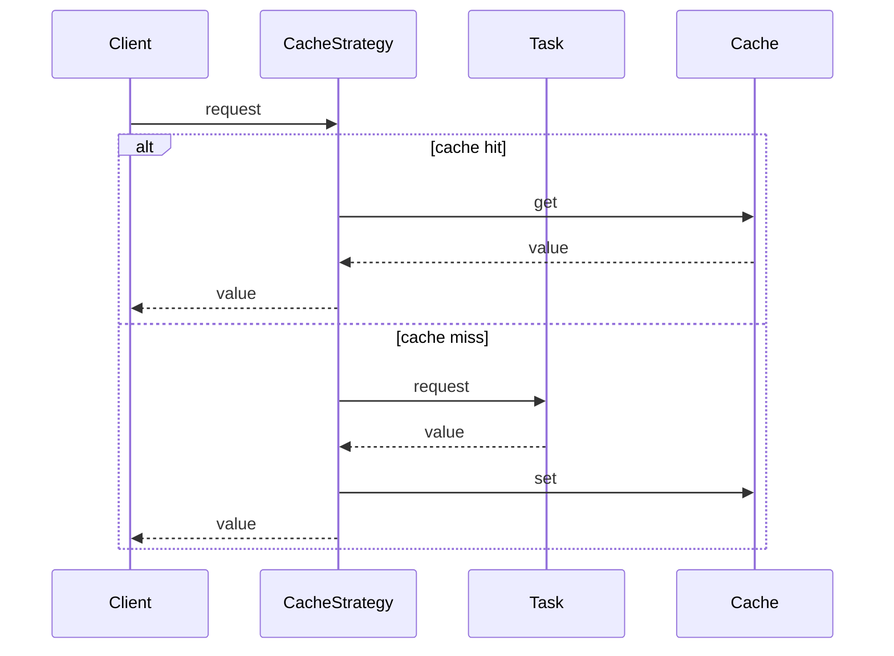

## Overview

This class provides a caching mechanism to cache the results of asynchronous tasks. It allows for setting a time-to-live (TTL) for cached values and supports both `in-memory` and `localStorage` caching mechanisms.

### Key features

- **_Configurable TTL_**: Set the time-to-live for cached items to control their expiration.
- **_Persistent storage_**: Choose between in-memory cache or localStorage for persistence.
- **_Automatic caching_**: Tasks are automatically executed and cached based on their request data.
- **_Improved performance_**: Reduces redundant task executions by utilizing cached results.

### How it works

- **_Key generation_**: A unique key is generated based on the request data to identify the cached value.
- **_Cache lookup_**: The cache is checked for the key.
- **_Hit_**: If the key exists and the value is valid (not expired), it is returned directly.
- **_Miss_**: If the key is not found or expired, the task is executed.
- **_Store result_**: The result of the task is stored in the cache with the generated key and specified TTL.
- **_Return result_**: The task result is returned, either from the cache (hit) or directly from the execution (miss).

### Typical usage

```ts
const cacheOptions: CacheOptions = {
  ttl: '1m',
};

const cacheManager = new CacheManager();
const cacheStrategy = new CacheStrategy(cacheManager, cacheOptions);

async function fetchData(url: string) {
  try {
    const response = await cacheStrategy.execute(url, fetch);
    return response.json();
  } catch (error) {
    console.error('Failed to fetch data:', error);
  }
}
```

### Benefits

- Improves performance by reducing redundant calls to the data source.
- Reduces server load and network traffic.
- Improves responsiveness for subsequent requests with the same data.

### Considerations

- Cache invalidation strategies are needed to ensure cached data is consistent with the actual data source.
- Caching might not be suitable for frequently changing data or sensitive information.

## Types

### `CacheOptions`

Options for configuring the cache strategy.
| Property | Type | Description | Default |
| --- | --- | --- | --- |
| `ttl` | `TTL` | Time-to-live for cached values. | `'1s'` |
| `persist` | `boolean` | Indicates whether to use localStorage for persistence. | `3` |

## Class

### CacheStrategy

#### `Constructor: CacheStrategy(options?: Partial<CacheOptions>)`

- `constructor(cacheManager: CacheManager, options?: Partial<CacheOptions>)`: Initializes a new instance of the `CacheStrategy` class.

#### Methods

- `execute<TRequest, TTask extends PromiseAnyFunction, TResult = ReturnType<TTask>>(request: TRequest, task: TTask): Promise<TResult>`:
  - Executes a task with a caching mechanism.

## Sequence Diagram

The sequence diagram below illustrates the flow of a request through the `CacheStrategy`.


