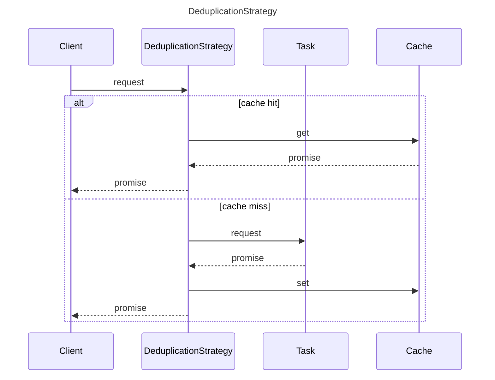

## Overview

### Purpose

This class provides a deduplication mechanism to prevents redundant execution of identical tasks.
This strategy is useful in scenarios where multiple identical requests may be made in a short period of time, and executing all of them would be redundant or resource-intensive.

### Key features

- **_Task Deduplication_**: Ensures each unique task is executed only once.
- **_Request Serialization_**: Identifies unique tasks based on a user-provided serialize function that maps requests to unique keys.
- **_Pending Task Tracking_**: Keeps track of ongoing tasks using a Map to avoid multiple executions for the same request.

### Typical usage

```ts
const deduplicationStrategy = new DeduplicationStrategy({
  serialize: (request: any) => JSON.stringify(request),
});

async function fetchData(url: string) {
  try {
    const response = await deduplicationStrategy.execute(url, fetch);
    return response.json();
  } catch (error) {
    console.error('Failed to fetch data:', error);
  }
}
```

### Benefits

- Helps prevent unexpected side effects from multiple executions of the same task.
- Optimizes performance and resource usage by avoiding unnecessary computations.

### Considerations

- Define a serialize function that accurately reflects task uniqueness based on your application's requirements.
- Be mindful of potential race conditions in highly concurrent environments. Consider additional synchronization mechanisms if needed.

## Types

### `DeduplicationOptions`

Options for configuring the deduplication strategy.
| Property | Type | Description | Default |
| --- | --- | --- | --- |
| `serialize` | `Function` | A function that serializes the request object into a string key for caching. | `-` |

## Class

### DeduplicationStrategy

#### `Constructor: DeduplicationStrategy(options?: Partial<CacheOptions>)`

- `constructor(options: DeduplicationOptions)`: Initializes a new instance of the `DeduplicationStrategy` class.

#### Methods

- `execute<TRequest, TTask extends PromiseAnyFunction, TResult = ReturnType<TTask>>(request: TRequest, task: TTask): Promise<TResult>`:
  - Executes a task with a deduplication mechanism.

## Sequence Diagram


