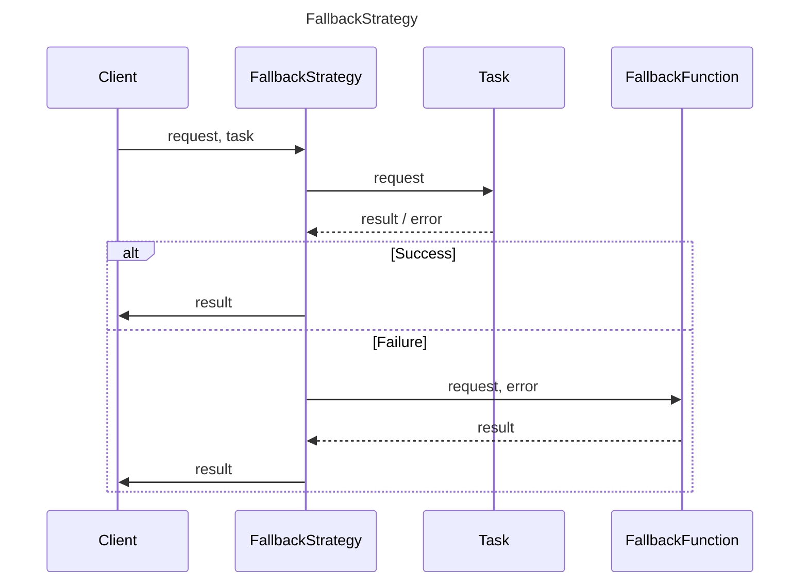

## Overview

This class provides a fallback mechanism to handle task failures by executing a function.

### Typical usage

```ts
// Primary task: fetch weather data from API
const fetchWeatherData = async (city) => {
  const response = await fetch(`/api/weather/${city}`);
  return await response.json();
};

// Fallback: read weather data from local cache
const fallbackWeatherData = (city) => {
  return JSON.parse(localStorage.getItem(city));
};

// Strategy instance
const weatherStrategy = new FallbackStrategy({
  fallback: fallbackWeatherData,
});

// Usage in your application
const getWeather = async (city) => {
  const data = await weatherStrategy.execute(city, fetchWeatherData);
  return data;
};
```

### Benefits

- Improves resilience by handling task failures gracefully.
- Provides an alternative outcome when the main task cannot be completed.

## Types

### `FallbackOptions`

Options for configuring the fallback strategy.
| Property | Type | Description | Default |
| --- | --- | --- | --- |
| `fallback` | `Function` | The fallback function to be executed on failure. | `-` |

## Class

### FallbackStrategy

#### `Constructor: FallbackStrategy(options?: Partial<CacheOptions>)`

- `constructor(options: FallbackOptions)`: Initializes a new instance of the `FallbackStrategy` class.

#### Methods

- `execute<TRequest, TTask extends PromiseAnyFunction, TResult = ReturnType<TTask>>(request: TRequest, task: TTask): Promise<TResult>`:
  - Executes a task with a fallback mechanism.

## Sequence Diagram


