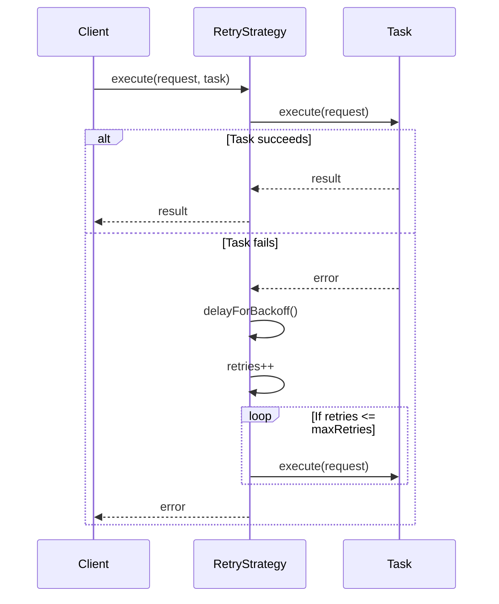

## Overview

This class provides a retry mechanism for tasks with exponential backoff. It allows you to automatically re-attempt failed tasks up to a specified number of times with increasing delays between attempts.

### Key features

- **_Configurable_**: Set the maximum number of retries and the delay between them.
- **_Automatic retries_**: Handles errors and retries tasks automatically.
- **_Exponential backoff_**: Increases the delay between retries to avoid overwhelming the server.

### Typical Usage

```ts
const retryStrategy = new RetryStrategy({
  maxRetries: 5,
  delay: '2s',
});

async function fetchData(url: string) {
  try {
    const response = await retryStrategy.execute(url, fetch);
    return response.json();
  } catch (error) {
    console.error('Failed to fetch data:', error);
  }
}
```

### Benefits

- Enhances resilience to transient errors.
- Improves success rates for tasks that may experience temporary failures.
- Reduces load on the server by spacing out retries instead of sending them immediately after each failure.

### Considerations

- Ensure proper error handling within the task function and in the application using the strategy.
- Set appropriate `maxRetries` to avoid excessive retries for persistent errors.
- Adjust `delay` values based on system requirements and error patterns.

## Types

### `RetryOptions`

Options for configuring the retry strategy.
| Property | Type | Description | Default |
| --- | --- | --- | --- |
| `maxRetries` | `number` | The maximum number of retries. | `3` |
| `delay` | `TTL` | The delay between retries. | `'1s'` |

## Class

### RetryStrategy

#### `Constructor: RetryStrategy(options?: Partial<RetryOptions>)`

- `constructor(options?: Partial<RetryOptions>)`: Initializes a new instance of the `RetryStrategy` class.

#### Methods

- `execute<TRequest, TTask extends PromiseAnyFunction, TResult = ReturnType<TTask>>(request: TRequest, task: TTask): Promise<TResult>`:
  - Executes a task with a retry mechanism.

## Sequence Diagram


