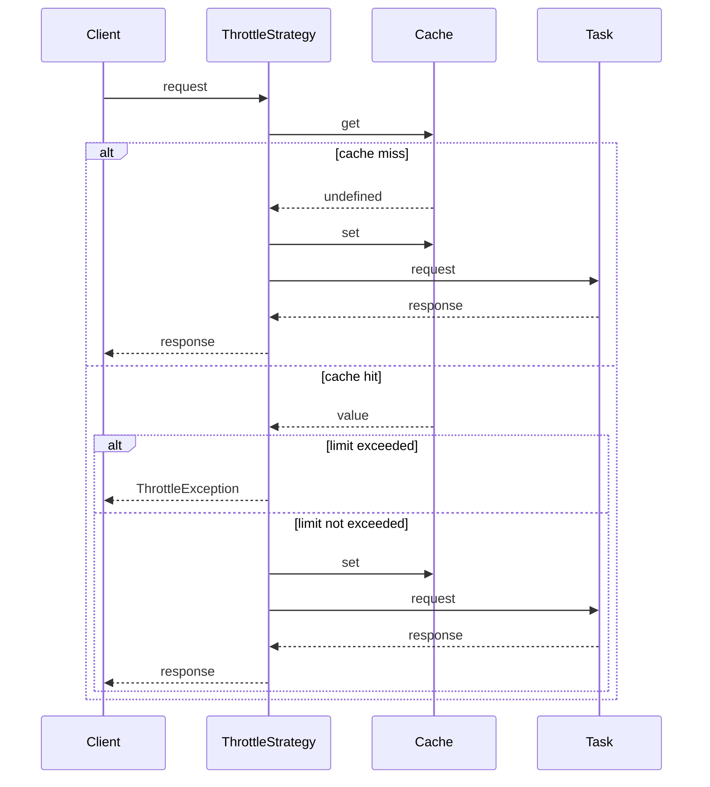

## `ThrottleStrategy`

The Throttle Strategy is a strategy designed to limit the number of requests that can be made within a specific time frame. It employs caching to keep track of request counts and throws a `ThrottleException` if the request limit is exceeded.

## `Constructor`

```ts
new ThrottleStrategy(cache: CacheDriverContract<string>, options?: Partial<ThrottleOptions>)
```

The constructor accepts a cache driver and an optional `ThrottleOptions` object.

| Property  | Type                  | Description              | Default                 |
| --------- | --------------------- | ------------------------ | ----------------------- |
| `cache`   | `CacheDriverContract` | The cache driver to use. | -                       |
| `options` | `ThrottleOptions`     | The strategy options.    | { ttl: '5s', limit: 5 } |

### `ThrottleOptions`

| Property | Type     | Description                                                             | Default |
| -------- | -------- | ----------------------------------------------------------------------- | ------- |
| `ttl`    | `TTL`    | The time to live (TTL) for the cache.                                   | `'5s'`  |
| `limit`  | `number` | The maximum number of the same request that can be made within the TTL. | `5`     |

## `Methods`

### `execute<TRequest, TTask extends PromiseAnyFunction, TResult = ReturnType<TTask>>(request: TRequest, task: TTask): Promise<TResult>`

The `execute` method runs the task with the provided request.

| Parameter | Type       | Description             |
| --------- | ---------- | ----------------------- |
| `request` | `TRequest` | The request to execute. |
| `task`    | `TTask`    | The task to execute.    |

Returns: `Promise<TResult>` - The result of the task, or throws a `ThrottleException` if the rate limit is exceeded.

## `ThrottleException`

`ThrottleException` is a custom error class thrown when the rate limit is exceeded.

### `Constructor`

```ts
new ThrottleException(limit: number, ttl: TTL)
```

The constructor accepts the limit and TTL.

| Parameter | Type     | Description                             |
| --------- | -------- | --------------------------------------- |
| `limit`   | `number` | The maximum number of requests per TTL. |
| `ttl`     | `TTL`    | The time to live (TTL) for the cache.   |

## `Usage`

To utilize the `ThrottleStrategy`, instantiate it with a cache driver and optional configuration options. Then, call the `execute` method with the request and task to be executed.

```ts
const cache = new InMemoryCache();
const throttleOptions: ThrottleOptions = {
  ttl: '5s', // Example: Set TTL to 5 seconds
  limit: 5, // Example: Set limit to 5 requests
};

const throttleStrategy = new ThrottleStrategy(cache, throttleOptions);

try {
  const result = await throttleStrategy.execute(request, task);
} catch (error) {
  if (error instanceof ThrottleException) {
    // Handle throttle exception
  }
}
```

## `Sequence Diagram`

The sequence diagram below illustrates the flow of a request through the `ThrottleStrategy`. If the request limit is exceeded, a `ThrottleException` is thrown.


