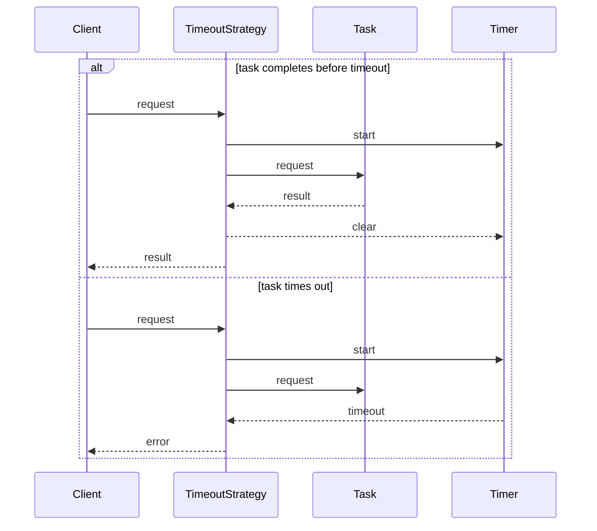

## `TimeoutStrategy`

The Timeout Strategy is designed to execute tasks with a specified time limit. This strategy allows the system to gracefully handle tasks that exceed their expected execution time.

### `Constructor`

```ts
new TimeoutStrategy(options?: Partial<TimeoutOptions>)
```

The constructor accepts an optional `TimeoutOptions` object.

| Property  | Type  | Description                                 | Default |
| --------- | ----- | ------------------------------------------- | ------- |
| `timeout` | `TTL` | The time to live before the task times out. | '30s'   |

### `Execute Method`

```ts
execute<TRequest, TTask extends PromiseAnyFunction, TResult>(request: TRequest, task: TTask): Promise<TResult>
```

The `execute` method runs the task with the provided request.

| Parameter | Type       | Description               |
| --------- | ---------- | ------------------------- |
| `request` | `TRequest` | The request for the task. |
| `task`    | `TTask`    | The task to execute.      |

Returns: `Promise<TResult>` - The result of the task, or throws a `TimeoutException` if the task times out.

## `TimeoutException`

`TimeoutException` is a custom error class thrown when a task exceeds its allotted time.

### `Constructor`

```ts
new TimeoutException(timeout: number)
```

The constructor accepts the timeout duration in milliseconds.

| Parameter | Type     | Description                  |
| --------- | -------- | ---------------------------- |
| `timeout` | `number` | The timeout in milliseconds. |

## `Usage`

To use the `TimeoutStrategy`, instantiate it with optional configuration options. Then, call the `execute` method with the request and task to be executed.

```ts
const timeoutOptions: TimeoutOptions = {
  timeout: '1m', // Example: Set timeout to 1 minute
};

const timeoutStrategy = new TimeoutStrategy(timeoutOptions);

try {
  const result = await timeoutStrategy.execute(request, task);
} catch (error) {
  if (error instanceof TimeoutException) {
    // Handle timeout exception
  }
}
```

## `Sequence Diagram`

The sequence diagram below illustrates the flow of a request through the `TimeoutStrategy`. If the task completes before the timeout, the result is returned. If the task times out, a `TimeoutException` is thrown.


